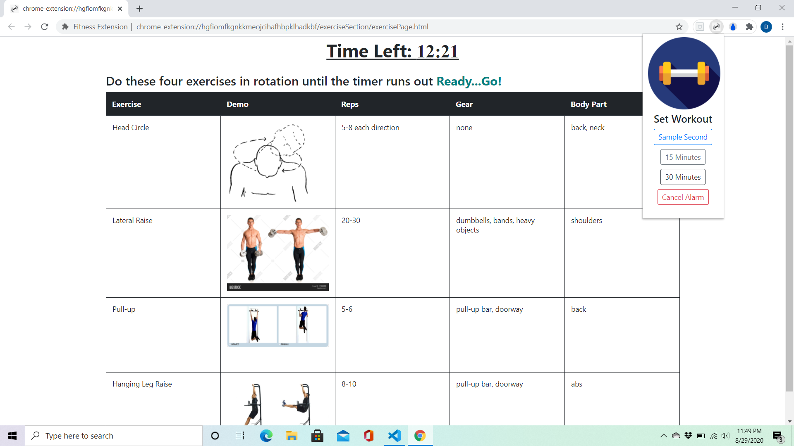
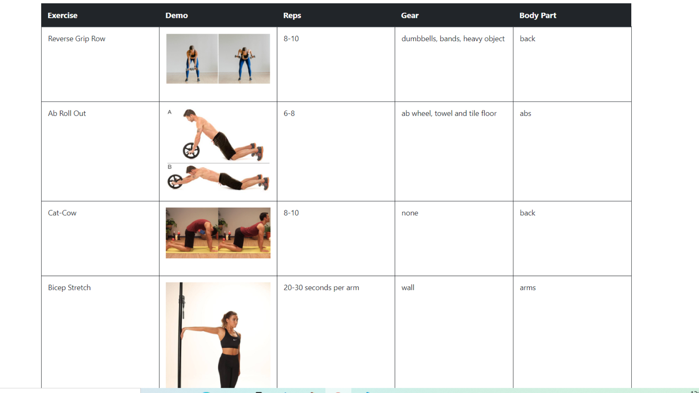

# Fitness-Extension

A fully responsive chrome extension that allows the user to set an alarm to do a workout that is displayed for them.

Can be found on the Chrome Webstore: <a href="https://chrome.google.com/webstore/detail/fitness-extension/migglmgcjikcjpjocgmikjecplnikehm">Fitness Extension</a>

Features:

<li>The popup allows the user to set the time to do a workout</li>
<li>When the alarm goes off a new tab pops up with a workout displayed</li>
<li>The exercises are picked at random so the user will get a different workout each time the alarm goes off</li>
<li>The workout is short but intense and can be done anywhere and anytime with minimal equipment needed</li>

<h3>Sample Images</h3>

